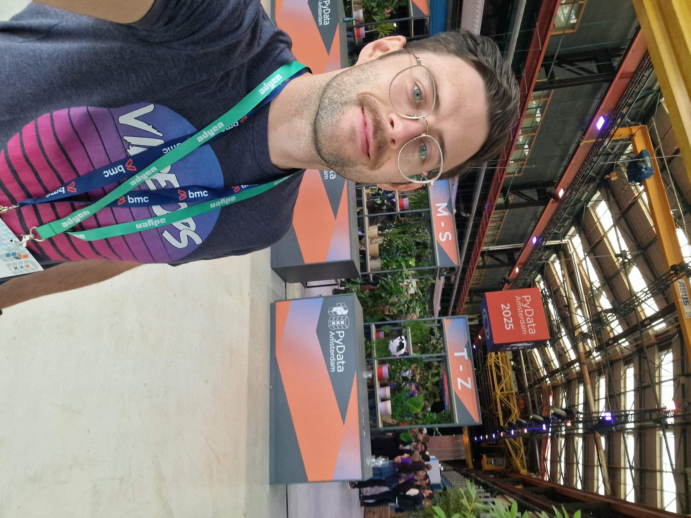

---
format:
  html:
    page-layout: custom
    embed-resources: true
    toc: false
    minimal: true
---

```{=html}
<style>
  @import url('https://fonts.googleapis.com/css2?family=Inter:wght@300;400;500;600;700&display=swap');

  * { margin: 0; padding: 0; box-sizing: border-box; }

  body {
    font-family: 'Inter', -apple-system, BlinkMacSystemFont, 'Segoe UI', sans-serif;
    background-image: url('img/gradient-background.jpg');
    background-size: cover;
    background-position: center;
    min-height: 100vh;
    display: flex;
    justify-content: center;
    align-items: center;
    padding: 2rem;
  }

  .page {
    width: 100%;
    max-width: 100%;
    background: white;
    border-radius: 16px;
    overflow: hidden;
    box-shadow: 0 12px 40px rgba(0, 0, 0, 0.25);
    max-width: 1125px;
  }

  /* Hero banner with gradient background */
  .hero {
    background: linear-gradient(135deg, #1a1921, #25232e);
    padding: 3.5rem 3rem 3rem;
    display: flex;
    align-items: center;
    gap: 2.5rem;
  }

  .headshot {
    width: 160px;
    height: 160px;
    border-radius: 50%;
    object-fit: cover;
    border: 4px solid rgba(255, 255, 255, 0.3);
    flex-shrink: 0;
  }

  .hero-text h1 {
    color: white;
    font-size: 2.8rem;
    font-weight: 700;
    letter-spacing: -0.03em;
    line-height: 1.1;
  }

  .hero-text .role {
    color: rgba(255, 255, 255, 0.85);
    font-size: 1.4rem;
    font-weight: 400;
    margin-top: 0.5rem;
  }

  .hero-text .role strong {
    color: white;
    font-weight: 600;
  }

  /* Body */
  .body {
    padding: 2.5rem 3rem;
    display: flex;
    gap: 3rem;
    align-items: flex-start;
  }

  .bio {
    flex: 1.2;
  }

  .bio ul {
    list-style: none;
    padding: 0;
  }

  .bio li {
    font-size: 1.15rem;
    line-height: 1.6;
    color: #333;
    padding: 0.6rem 0;
    border-bottom: 1px solid #eee;
    display: flex;
    align-items: center;
    gap: 0.8rem;
  }

  .bio li:last-child {
    border-bottom: none;
  }

  .bio li .marker {
    color: #FF6B4A;
    font-weight: 700;
    font-size: 1.2rem;
    flex-shrink: 0;
  }

  .bio .org {
    font-weight: 600;
    color: #000;
  }

  /* QR side */
  .qr-side {
    flex: 0.6;
    display: flex;
    flex-direction: column;
    align-items: center;
    gap: 0.8rem;
    padding-top: 0.5rem;
  }

  .qr-side img {
    width: 140px;
    height: 140px;
    border-radius: 8px;
    border: 2px solid #eee;
  }

  .qr-side .cta {
    font-size: 1rem;
    font-weight: 600;
    color: #000;
    text-align: center;
  }

  .qr-side .sub {
    font-size: 0.85rem;
    color: #808080;
    text-align: center;
    line-height: 1.4;
  }

  /* Footer */
  .footer {
    padding: 1rem 3rem;
    border-top: 1px solid #eee;
    display: flex;
    justify-content: space-between;
    align-items: center;
  }

  .footer-left {
    font-size: 0.95rem;
    color: #808080;
  }

  .footer-left a {
    color: #FF6B4A;
    text-decoration: none;
    font-weight: 500;
  }

  .footer-logo img {
    height: 24px;
    opacity: 0.6;
  }
</style>

<div class="page">
  <div class="hero">
    
    <div class="hero-text">
      <h1>Bauke<br>Brenninkmeijer</h1>
      <div class="role">Research Engineer @ <strong>orq.ai</strong></div>
    </div>
  </div>

  <div class="body">
    <div class="bio">
      <ul>
        <li><span class="marker">-</span> Computer Science @ <span class="org">Radboud University</span></li>
        <li><span class="marker">-</span> Joined <span class="org">orq.ai</span> in August 2025</li>
        <li><span class="marker">-</span> Previously at <span class="org">ABN AMRO</span> & <span class="org">ING</span></li>
        <li><span class="marker">-</span> Organiser @ <span class="org">MLOps Community Amsterdam</span></li>
      </ul>
    </div>

    <div class="qr-side">
      
      <div class="cta">Connect on LinkedIn</div>

    </div>
  </div>

  <div class="footer">
    <div class="footer-left">
      <a href="mailto:bauke.brenninkmeijer@orq.ai">bauke.brenninkmeijer@orq.ai</a>
    </div>
    <div class="footer-logo">
      
    </div>
  </div>
</div>
```
